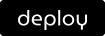

## Create webapp directory

- This will be the working directory of your web application.

  ```shell
  mkdir webapp && cd webapp
  ```

- Open vscode editor from the working directory

  ```shell
  code .
  ```

## Create entry point file

- Create `main.ts` file.

- This will be the entry point of Deno CLI.

  ```typescript
  import application from "https://deno.land/x/fastro@/server/mod.ts";

  const app = application();

  app.get("/", () => "Hello world");

  await app.serve();
  ```

## Run locally

- You can run the webapp from local

  ```shell
  deno run -A --unstable main.ts
  ```

- Or try running a simple program from repo:

  ```shell
  deno run -A --unstable https://deno.land/x/fastro@v0.54.0/examples/main.ts
  ```

## Deployments

- When clicking the "Deploy" button -- deno-deploy will automatically download all the application code and create a new deployment.

  [](https://dash.deno.com/new?url=https://deno.land/x/fastro@v0.54.0/examples/main.ts)

- Other deployment methods can be seen [here](https://deno.com/deploy/docs/deployments).
