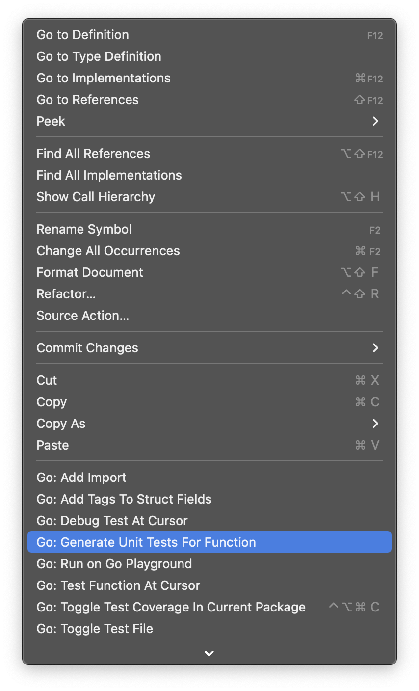

Catatan ini berisi penjelasan *se-simple* mungkin tentang cara testing di golang cara menggunakannya di mongodb.

### Pendahuluan

Pada [catatan sebelumnya](/posts/cancel) kita telah menggunakan context dan cancel di mongodb. Pada tulisan kali ini kita akan membahas bagaimana cara melakukan testing di mongodb.

### Persiapan

Kita akan sedikit melakukan perubahan pada fungsi `createBookRepository` agar instance dari collection bisa kita generate dari luar fungsi.
```go
func createBookRepository(
	collection *mongo.Collection,
	timeout time.Duration,
) *repository {
	return &repository{
		collection: collection,
		timeout:    timeout,
	}
}
```
Jika sebelumnya `collection` kita buat di dalam fungsi, kali ini kita pindahkan dia ke dalam fungsi terpisah.
```go
func createCollection(
	ctx context.Context,
	timeout time.Duration,
	uri, db, col string,
) (*mongo.Collection, error) {
	ctx, cancel := context.WithTimeout(ctx, timeout)
	defer cancel()

	client, err := mongo.Connect(ctx, options.Client().ApplyURI(uri))
	if err != nil {
		return nil, err
	}
	return client.Database(db).Collection(col), nil
}
```
*Kode selengkapnya: [bisa diakses di sini](https://github.com/fastrodev/praktikum-repository/blob/f1e0933fa47cb725aefd0499093fa560ab7c4a69/main.go#L31)*

Ini kita lakukan agar kita bisa membuat simulasi koneksi database yang berhasil dan gagal. Simulasi sukses dan gagal tersebut akan kita gunakan ketika testing.

### Test createBookRepository
1. Buka source-code dengan [vs-code](https://code.visualstudio.com/). 
2. Arahkan pointer di atas fungsi `createBookRepository`. 
3. Klik kanan, lalu pilih `Go: Generate Unit Tests This Function`
    
4. Jika ok, nanti akan muncul file baru: `main_test.go`
    ```go
    func Test_createBookRepository(t *testing.T) {
        type args struct {
            collection *mongo.Collection
            timeout    time.Duration
        }
        tests := []struct {
            name string
            args args
            want *repository
        }{
            // TODO: Add test cases.
        }
        for _, tt := range tests {
            t.Run(tt.name, func(t *testing.T) {
                if got := createBookRepository(tt.args.collection, tt.args.timeout); !reflect.DeepEqual(got, tt.want) {
                    t.Errorf("createBookRepository() = %v, want %v", got, tt.want)
                }
            })
        }
    }
    ```
5. Ganti `// TODO: Add test cases.` dengan input dan output yang kita inginkan. Jika sukses harapannya apa. Jika gagal harapannya apa.
    ```go
    {
        name: "success create repository",
        args: args{
            collection: successCollection,
            timeout:    timeout,
        },
        want: &repository{
            collection: successCollection,
            timeout:    timeout,
        },
    },
    {
        name: "fail create collection",
        args: args{
            collection: errCollection,
            timeout:    timeout,
        },
        want: &repository{
            collection: errCollection,
            timeout:    timeout,
        },
    },
    ```
    *Kode selengkapnya: [bisa diakses di sini](https://github.com/fastrodev/praktikum-repository/blob/test/main_test.go)*

### Cara testing
Buka terminal dan ketik command berikut:
```
go test -run Test_createBookRepository -v
```
Hasilnya:
```
=== RUN   Test_createBookRepository
=== RUN   Test_createBookRepository/success_create_repository
=== RUN   Test_createBookRepository/fail_create_collection
--- PASS: Test_createBookRepository (0.06s)
    --- PASS: Test_createBookRepository/success_create_repository (0.00s)
    --- PASS: Test_createBookRepository/fail_create_collection (0.00s)
PASS
ok      praktikum-crud  0.262s
```